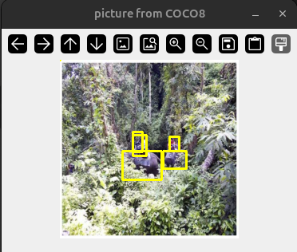
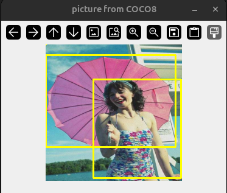
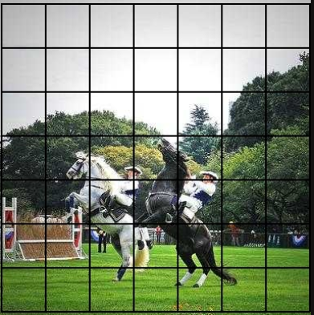

# Локализация объетов

## примеры локализатора

 

Учиться на **COCO**

## как это работает
Изображение делиться на сетку 7x7 (grid cell). 

В **каждой** клетке, независимо, указываются координаты центра объекта в стиле CXCYWH (x_center, y_center, width, height) в **нормализованном** виде. CXCY определяют центр объекта в клетке, WH определяют длину и высоту ограничивающей рамки **относительно** изображения (длина рамки * длина изображения). 

Сетка позволяет моделе смотреть на изображение через "лупу", фокусируясь на каждом кусочке, что делает обучение гораздо более продуктивным. 

## конфигурация
*Пользовательский* конфигурационный файл - это файл в котором пользователь может изменить что-то по своему вкусу. Например, цвет ограничивающей рамки.

*Системный* конфигурационный файл - файл который позволяет изменить настройки модели. Например, количество обучающих эпох, размер сетки и др. Изменение настроек может сделать обучение лучше.   